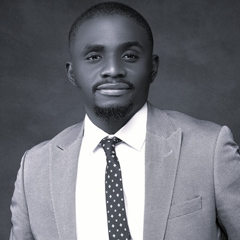

# Seun Alo
---

🔗 [LinkedIn](https://www.linkedin.com/in/seunalo) | [GitHub](https://github.com/snalo) | [ResearchGate](https://www.researchgate.net/profile/Seun-Alo) | [Google Scholar](https://scholar.google.com/citations?user=G3mc-ksAAAAJ&hl=en)

  

I am **Oluwaseun (Seun) Alo**, a **Ph.D. candidate in Electrical Engineering** at the **University of Kentucky**, conducting research at the [**Unconventional Computing Architectures and Technologies (UCAT)**](https://www.engr.uky.edu/research-faculty/research-centers-labs/ucat) Laboratory. My work lies at the intersection of **hardware acceleration, photonic computing, and emerging computing architectures**.

Currently, I am designing and evaluating **photonic-based hardware accelerators** for *geometric and deep learning applications*, developing **energy-efficient tensor processing architectures**, and conducting **Ferromagnetic Resonance (FMR)** experiments for **spintronic material characterization** toward hybrid **photonic–magnetic computing** systems. My research integrates device-level modeling, dataflow optimization, and system co-design to push the limits of energy-efficient AI hardware.

Before my Ph.D., I worked at **Huawei Technologies Nigeria Co. Ltd**, where I led multi-vendor **network infrastructure and system integration projects**, focusing on hardware reliability, signal optimization, and scalable communication solutions. My professional and research experiences bridge **hardware design, optical interconnects, and computing systems**, motivating my pursuit of next-generation **photonic and neuromorphic accelerators**.

---

## Education

- **Ph.D. in Electrical Engineering**, *University of Kentucky*, Lexington, KY *(Aug 2022 – Present)*  
  *Dissertation (in progress): Design of an Efficient, Scalable, and Flexible Tensor Processing Architecture with Photonic Integrated Circuits*  
- **M.Sc. in Electrical/Electronic Engineering**, *University of Ibadan*, Nigeria *(2019)*  
- **B.Eng. in Electrical/Electronic Engineering**, *Federal University of Technology, Akure*, Nigeria  

---

## Professional Experience

### **Graduate Researcher – UCAT Lab, University of Kentucky**  
*Aug 2022 – Present*  
- Design and evaluate **photonic-based hardware accelerators** for geometric and deep learning applications.  
- Develop **tensor processing architectures** with optimized dataflows for high-throughput, low-power computation.  
- Conduct **Ferromagnetic Resonance (FMR)** experiments to analyze damping and anisotropy in thin-film materials for **spintronic device modeling**.  
- Model and simulate **photonic integrated circuits (PICs)** for optical interconnect optimization using *Lumerical* and *Cadence*.  
- Publish in **IEEE** and **ACM** venues on **GEMM accelerators**, **photonic tensor cores**, and **neuromorphic computing systems**.  

### **Project Manager – Huawei Technologies Nig. Co. Ltd, Lagos, Nigeria**  
*Sep 2017 – Aug 2022*  
- Managed large-scale **network infrastructure and system integration projects**, emphasizing hardware reliability and performance optimization.  
- Collaborated with cross-functional engineering teams to evaluate hardware modules, resolve design bottlenecks, and improve throughput and latency.  
- Delivered **energy-efficient telecom solutions** leveraging embedded and optical communication hardware systems.  

### **Research Assistant – University of Ibadan, Nigeria**  
*Aug 2016 – Mar 2019*  
- Conducted **computational experiments in signal and image analysis** using feature-extraction and pattern-recognition algorithms.  
- Integrated **MATLAB** and **Python** workflows for simulation, modeling, and algorithmic performance evaluation.  
- Co-authored publications on **statistical texture analysis** and **content-based image retrieval systems**.  

---

## Research Interests

- Hardware Design and Acceleration  
- Energy-Efficient and Scalable Architectures  
- Photonic and Neuromorphic Computing  
- Optical and Photonic Interconnect Systems  

---

## Selected Projects

### **Ferromagnetic Resonance (FMR) Characterization (Ongoing)**
Conducting FMR-based material characterization to model magnetic damping, anisotropy, and resonance properties in thin-film heterostructures. The insights guide hybrid **spintronic-photonic computing** designs and device modeling for next-generation accelerators.

### **Photonic Tensor Processing Architecture**
Designed scalable tensor processing cores using **photonic integrated circuits (PICs)** for energy-efficient deep learning workloads. Focused on architecture design, throughput optimization, and dataflow efficiency.

### **GEMM Accelerator for Neural Networks (SPOGA)**
Developed and optimized low-power GEMM accelerator architectures targeting **integer and byte-size matrix multiplication** kernels for ML workloads.

### **Optical Stochastic Computing Accelerator (ASTRA)**
Contributed to the design and simulation of **stochastic transformer-based accelerators** using silicon photonics, improving performance and reducing power dissipation for large language model workloads.

---

## Selected Publications

1. **I. Thakkar, S. S. Vatsavai, V. S. P. Karempudi, and O. A. Alo.**  
   *Scaling Up the Sustainability of Photonic Tensor Cores with Device-Circuit-Signaling Co-Design*, **IEEE ICCD 2025**, Dallas, TX, USA.  

2. **S. Afifi, O. A. Alo, I. Thakkar, and S. Pasricha.**  
   *ASTRA: A Stochastic Transformer Neural Network Accelerator with Silicon Photonics*, **ACM Transactions on Embedded Computing Systems**, 2025.  

3. **S. Afifi, O. A. Alo, I. Thakkar, and S. Pasricha.**  
   *A Light-Speed Large Language Model Accelerator with Optical Stochastic Computing*, **GLSVLSI 2025**, pp. 922–928.  

4. **O. A. Alo, S. S. Vatsavai, and I. Thakkar.**  
   *Scaling Analog Photonic Accelerators for Byte-Size, Integer GEMM Kernels*, **IEEE ISVLSI 2024**, Knoxville, TN, USA.  
   [https://doi.org/10.1109/ISVLSI61997.2024.00080](https://doi.org/10.1109/ISVLSI61997.2024.00080)

5. **O. A. Alo** and **A. R. Zubair.**  
   *Content-Based Image Retrieval System Using Second-Order Statistics*, **IJCA**, 2020.  
   [https://doi.org/10.5120/ijca2020920475](https://doi.org/10.5120/ijca2020920475)

---

## Technical Skills

**Hardware & Design Tools:** Cadence, Lumerical, MATLAB, VLSI Design, EDA Tools  
**Programming:** Python, C++, Git, Linux, SystemVerilog (basic)  
**Machine Learning / Simulation:** PyTorch, TensorFlow  

---

<h2 align="center">
  <a href="https://snalo.github.io/assets/Oluwaseun_Alo_Resume.pdf" download style="text-decoration: none;">
    
      📄 Download Resume
    
  </a>
</h2>
